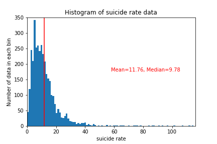
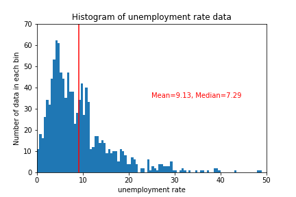
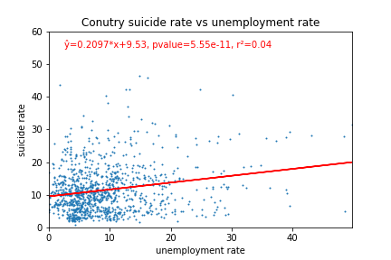

# Poverty's Effect on Mental Health
## Overiew
## Repo Contents
- Main_Findings - Contains all work down to answer the main research question.
    - [mian_data_exploration.ipynb](Main_Findings\main_data_exploration.ipynb)
    - [main_data_analysis.ipynb](Main_Findings\main_data_analysis.ipynb)
    - Clean_Data - stores csv files that were created in the data exploration step so that they could be used in the data analysis step.
        - [suicide_vs_unemployemnet_clean.csv](Main_Findings\Clean_Data\suicide_vs_unemployment_clean)
        - [suicide_vs_gdp_clean.csv](Main_Findings\Clean_Data\suicide_vs_gdp_clean)
- Additional_Findings - Contains work that answers additions research questions.
    - [suicide_vs_unemployment_state.ipynb]()
    - [suicide_vs_gdp_state.ipynb]()
    - [suicide_vs_ihdi_country.ipynb]()
    - Resources - Stores all csv files downloaded to conduct analysis.
        - [state_unemployment_USBLS.csv](Additional_Findings\Resources\state_unemployment_USBLS.csv)
        - [state_gdp_USDOC.csv](Additional_Findings\Resources\state_gdp_USDOC.csv)
        - [state_suicide_CDC.csv](Additional_Findings\Resources\state_suicide_CDC.csv)
        - [country_ihdi_WHO.csv](Additional_Findings\Resources\country_ihdi_WHO.csv)
## Project Proposal
Group Number: 5

Group Members: Jacob Douthett, Ben Johnson, Jae Neuharth, Andrew Sundquist

Proposed Topic: Poverty's effect on mental health.

Overview: We plan to study how diferent economic factors, specifically unemployment rate, affect suicide rate.
### Main Research Question
- Is there a correlation between a country's unemployment rate and suicide rate?
### Main Hypothesis
- Countries with higher unemployment rates have higher suicide rates.
### Main Datasets
- The [global health observatory api from the WHO](https://www.who.int/data/gho/info/gho-odata-api) provides global data on [suicide rates](https://ghoapi.azureedge.net/api/MH_12) for nearly 200 countries.
- The [world bank's api](https://datahelpdesk.worldbank.org/knowledgebase/articles/889392-about-the-indicators-api-documentation) provides global data on [unemployment rates](https://api.worldbank.org/v2/country/indicator/JI.UEM.1564.ZS?format=json) for over 150 countries.
### Additional Research Questions and Datsets
- Is there a correlation between a country's per capita GDP and suicide rate?
- Do the same correlations, such as GDP vs suicide rate, exist on US state level?
- Is inequality-adjusted human developement index (IHDI) correlated with suicide rate?
- The [world bank's api](https://datahelpdesk.worldbank.org/knowledgebase/articles/889392-about-the-indicators-api-documentation) also provides data on [per capita GDP](https://api.worldbank.org/v2/country/indicator/NY.GDP.PCAP.CD?format=json).
- [Suicide rates by state](Additional_Findings\Resources\state_suicide_CDC.csv) data can be downloaded from the [CDC's 'Wonder'](https://wonder.cdc.gov/) database. 
- [Per capita GDP by state](Additional_Findings\Resources\state_gdp_USDOC.csv) data can be downloaded from [Data.gov](https://data.gov/).
- [Unemployment rate by state](Additional_Findings\Resources\state_unemployment_USBLS.csv) data can be downloaded from [Iowa State University](https://www.icip.iastate.edu/tables/employment/unemployment-states).
- [IHDI by country](Additional_Findings\Resources\country_ihdi_WHO.csv) data can be downloaded from [Human Development Project's Website](https://hdr.undp.org/data-center/documentation-and-downloads).
## Milestones
- Project proposal approval
    - Written proposal &check;
    - Instructor approval &check;
- Data acquisition and cleanup
    - Data sources Identified &check;
    - Data files/APIs created &check;
    - NA data removed, DFs merged ect. and can print DFs &check;
- Data manipulation
    - Filter, sort, groupby to get useful data out of DFs &check;
    - data.ipynb complete &check;
- Graph/Charts
    - Create all needed graphics &check;
- Regression Analysis
    - Perform regression tests &check;
- Written Analysis
    - analysis.ipynb complete &check;
## Main Analysis and Findings
### Is there a correlation between a country's unemployment rate and suicide rate?
The main research question investigates whether a country's unemployment rate is correlated with its suicide rate. Their distributions of both sets of data are plotted in histograms. The scatter plot shows the two variables for 153 countries across 17 years of data. A linear regression was performed to test the null hypothesis, country suicide rate has a zero slope regression coefficient when plotted against unemployment rate. The main takeaways are:
- Both sets of data are right skewed and have means higher than their modes/medians.
- The pvalue for the linear regression is 5.55x10^-11 which is much less than alpha = 0.05. This means we can confidently reject the null hypothesis; 1 out 18,000,000 times we will be wrong in doing so.
- The slope of the linear regression line is positive meaning as unemployment rate increase, suicide rate increases.
- The coefficient of correlation, r^2, is 0.04 which is very close to 0. This indicates the data is not well correlated.
- The combination of low pvalue and small r^2 means the data is negatively correlated but the linear equation is not a great predictor of suicide rate.
- The data analysis supports our hypothesis that countries with higher unemployment rate have higher suicide rates (positive slope and low pvalue). However the linear model is not very useful for computations. The linear relation is accurate but not precise.

---
## Additional Analysis and  Findings
### Is there a correlation between a country's per capita GDP and suicide rate?
### Do the same correlations, such as GDP vs suicide rate, exist on US state level?
The main research question investigated the correlation between a country's unemployment and GDP vs it's Suicide Rate. Further investigation was performed at a state level using the [state_suicide_CDC.csv](Additional_Findings\Resources\state_suicide_CDC.csv), and a dataset from the BEA in the [state_gdp_USDOC.csv](Additional_Findings\Resources\state_gdp_USDOC.csv). The combined data provided data points for all 50 states from the years 1999 to 2020.

The jupyter notebook, [suicide_vs_gdp_state.ipynb](Additional_Findings\suicide_vs_gdp_state.ipynb) utilized these datasets. There were a few interesting findings based on the results. 
+ The null hypothesis was rejected (low p value below 0.05) when looking at GDP and Suicide Rate such that there is a non-zero slope where higher GDP results in lower Suicide Rate. However there are a few items of note:
    - The R Value is quite low which may indicate that there is not a strong correlation or that the linear regression will NOT be a great predictor of data.
    - The combination of the low P value (p = 0.0057 < p = 0. 05), and the low R value (r = - 0.08) caused some confusion, but generally speaking this tells us that the data is quite noisy/variable. So even though there is an observable trend in the linear regression, a certain GDP amount may result in a wide range of different suicide rates.
    - All this information leads us to believe that GDP is NOT a great indicator or predictor of suicide rates, and that there are obviously many more factors at play when it comes to causes of suicide Rates.

One other interesting item of note is that when viewing GDP vs Suicide Rate at a singular state level(ie, looking at just Minnesota instead of all 50 states), there is a strong positive correlation between higher GDP and higher suicide rates which is the opposite of the negative correlation when looking at all states together. 
### Is inequality-adjusted human developement index (IHDI) correlated with suicide rate?
Our main research question investigated the correlation between a country's Unemployment Rate / GDP vs. it's Suicide Rate; We also thought it would be interesting to compare [HDI / IHDI ratings](Additional_Findings\Resources\country_ihdi_UNDP) to Suicide Rates (we used the same Suicide Rate  and see if there was any correlation there. The HDI is an index designed to measure a country's level of human development that was created by the United Nations in 1990. The IHDI is a modified version of the HDI, created in 2010,  that is also designed to measure a country's level of human development, but takes into account the mass inequality throughout the world. Data for Suicide Rates was retrieved from the [Global Health Observatory API from the WHO](https://www.who.int/data/gho/info/gho-odata-api) which provides global data on [suicide rates](https://ghoapi.azureedge.net/api/MH_12).

The jupyter notebook: [suicide_vs_ihdi_country.ipynb](Additional_Findings\suicide_vs_ihdi_country.ipynb) used these datasets and performs a linear regression to test the null hypothesis: 'country suicide rate has a zero slope regression coefficient when plotted against IHDI / HDI'. Findings based on the results:
 - The P-Value for the linear regression of [HDI vs Suicide Rate](Additional_Findings\Images\HDI_vs_Suicide_Rate.jpg) is 2.69e-10, which is far lower than alpha = 0.05, meaning the null hypothesis for [HDI vs Suicide Rate](Additional_Findings\Images\HDI_vs_Suicide_Rate.jpg) can be confidently rejected.
 - The P-Value for the linear regression of [IHDI vs Suicide Rate](Additional_Findings\Images\IHDI_vs_Suicide_Rate.jpg) is 2.22e-08, which is also far lower than alpha = 0.05, meaning the null hypothesis for [IHDI vs Suicide Rate](Additional_Findings\Images\IHDI_vs_Suicide_Rate.jpg) can also confidently be rejected.
 - The slope for both regressions is negative, which shows that as HDI / IHDI ratings increase, suicide rates *usually* go down.
 - The coefficient of r^2 for [HDI vs Suicide Rate](Additional_Findings\Images\HDI_vs_Suicide_Rate.jpg) is 0.03, because this number is so close to 0, it can be noted that the data is not well correlated.
 - The coefficient of r^2 for [IHDI vs Suicide Rate](Additional_Findings\Images\IHDI_vs_Suicide_Rate.jpg) is 0.02, because this number is also so close to 0, it can be noted that this data is not well correlated either.
 - The combination of low p-value and low r^2 indicate that, similarly to the data in our main hypothesis the data is negatively correlated, but the linear equation is not a good predictor of suicide rate.
 
 
 
